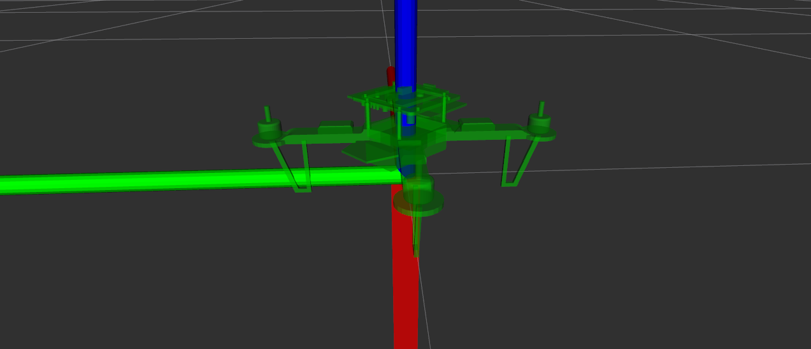
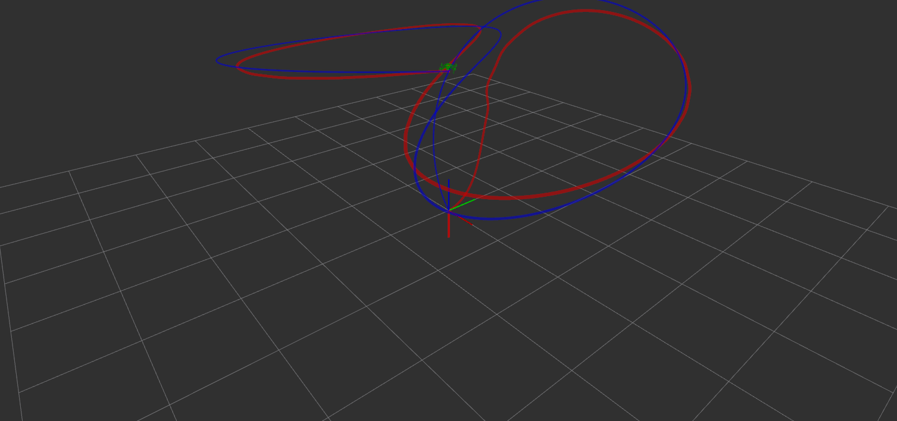

# CopteROS Project

CopteROS TU-Ilmenau, it has been tested using [ROS-Melodic](http://wiki.ros.org/melodic/Installation).

#### Note:
If there are problems with ros (e.g. rosnode, rostopic), delete completely ros using:
s
```
sudo apt-get purge ros-*
sudo apt-get purge python-ros*
sudo apt-get autoremove
```
This repository is a quadrotor robot operation system and consists of the following units:

0. Serial communication interface for XMC Widefield board
0. Nonlinear trajectory quadrotor control
0. Quadrotor Model for simulation
0. 21 State extended Kalman filter for quadrotor state estimate and sensor bias estimate
0. Ros Parameter Server
0. 3D Quadroter Visualisation
0. Force_Torque2PWM map to calculate PWM motor signals for desired Quadrotorframe force and torques
0. Trajectory generator

## Installation

For ROS installation and setup see the official [ROS documentation](http://wiki.ros.org/ROS/StartGuide).
Clone repository into a new workspace and build it with catkin-tools:

```
cd copteros
catkin init
source ./devel/setup.bash
catkin b
```

## Usage

It is possible to use the predefined startup scripts:

Simulation:
```
roslaunch copter simulation.launch
```
Quadrotor:
```
roslaunch copter system.launch
```
Otherwise start the individual nodes using rosrun. For this see package documentation below.

# Package Description

## Trajectory generation

To generate trajectory for copter.

```
rosrun trajectory trajectory
```





## Serial communication interface for XMC Widefield board

To receive sensor and battery cell voltage data from XMC Widefield board run:
```
rosrun xmcprotocol serialReceive
```
To send motor commands and servo angles execute:
```
rosrun xmcprotocol serialTransmit
```

## Nonlinear trajectory quadrotor control

For quadrotor control the controller proposed in paper [Minimum snap trajectory generation and control for quadrotors](http://ieeexplore.ieee.org/document/5980409/authors) by Daniel Mellinger and Vijay Kumar was implemented in a Matlab Simulink Model and the code was generated by the Matlab Coder.
The controller subscribes to the quadrotor state topic published by the extended Kalman filter or the simulation model and publishes the topic Force_Torque of desired force and torques for the quadrotor.

To run the controller execute:
```
rosrun control control_node
```

## Quadrotor Model

The 6-DOF (12 State) nonlinear quadrotor model was computed in Matlab by the Lagrange formalism and is implemented in a Matlab Simulink Model. The code was generated by the Matlab Coder.
The model node publishes the quadrotor state in the State topic at 200 Hz to test the controllers and maneuvres.
To execute the quadrotor model run:
```
rosrun model model_node
```

## Extended Kalman filter

The self designed extended Kalman filter implemented in a Matlab Simulink Model and the code was generated by the Matlab Coder. It fuses magnetometer, accelerometer, gyroscope measurements from the XMC Widefield board and relative position estimate from vision data. To evaluate the camera images and estimate the position at 100 Hz the openCV library is used but the code is not included in the public repository (package position_tracker).
The extended Kalman filter is running at a 100 Hz update rate and publishes the quadrotor state topic State.

To start the extended Kalman filter run:
```
rosrun state_estimation ekf_node
```

## ROS Parameter Server

All important parameters are managed by the ROS internal parameter server.

To load the parameters run the corresponding launch file in the copter package or run
```
rosparam load filename
```
To modify and view parameters online (non-persistent):
```
rosparam set param_name param_value
rosparam get param_name
```
For further information see the official [ROS documentation](http://wiki.ros.org/Parameter%20Server)

## 3D Quadrotor Visualization

It is possible to visualize the current quadrotor state published in the quadrotor state topic.
To run the visualization a xserver or XForwarding is neccessary.

To start the Rviz GUI run:
```
rosrun quad_viz_pub quad_viz_pub_node
rosrun rviz rviz
```

and select the corresponding marker topic.
For details see the official [ROS documentation](http://wiki.ros.org/rviz)

## Force_Torque2PWM map

Map to calculate PWM motor signals for desired Quadrotorframe force and torques with non-linear thrust curve.

The quadorcopter frame is defined coinciding with the quadrotor arms and the motor numbering and directions of rotation are depiced in the following figure.


<!-- Project developed by [Team Robotik AG Ilmenau](http://www2.tu-ilmenau.de/robotikag/) for [Copter.rocks](https://copter.rocks/teams/). -->
