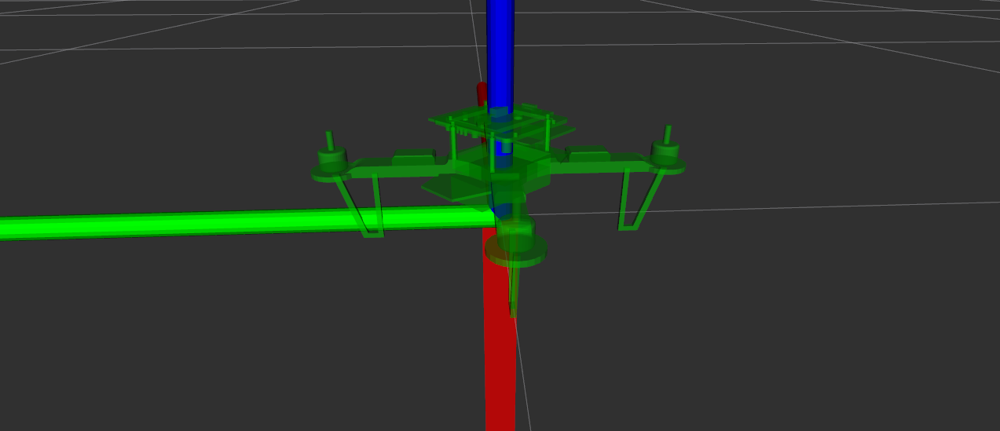
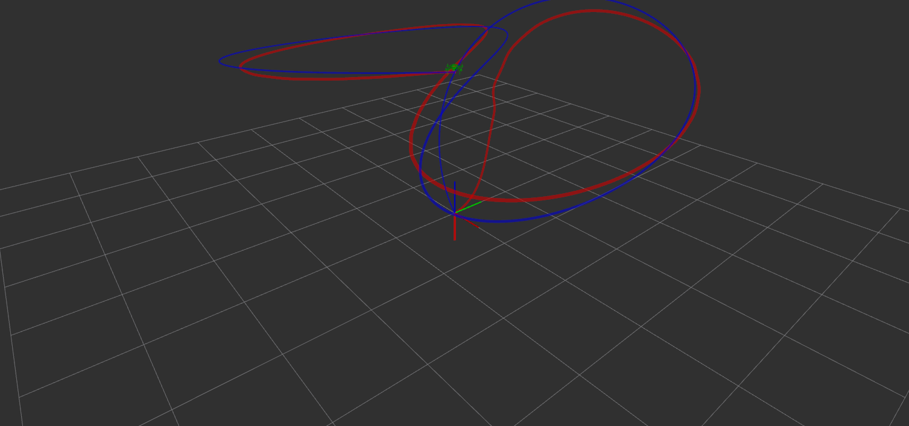

# 📘 Manual: Docker + ROS 2 + Package
##  CopterOS Example - Simulation RViz

> Ejecuta un contenedor ROS 2 (jazzy) con soporte para paquetes y GUI (opcional con X11).
> 
> 
> Funciona tanto en entornos sin pantalla física como con X11.
> 

---

## 📁 Estructura del proyecto

```
.
├── Dockerfile
├── docker-compose.yml
└── ros2_ws/
    ├── src/
    │   └── <tu_paquete_ros2>
    └── ...
    
##--------------------------------   
ros2_ws/
├── src/
│   ├── package_a/
│   │   ├── CMakeLists.txt
│   │   ├── package.xml
│   │   ├── src/
│   │   └── include/
│   │       └── package_a/
│   │           └── ...
│   │
│   ├── package_b/
│   │   ├── CMakeLists.txt
│   │   ├── package.xml
│   │   └── ...
│   │
│   ├── package_c/
│   │   └── ...
│
├── install/        ← generado por colcon
├── build/          ← generado por colcon
├── log/            ← generado por colcon
```

---

## ⚙️ Dockerfile

```docker
# Definimos la distribución de ROS como un argumento externo
ARG ROS_DISTRO=jazzy
FROM osrf/ros:${ROS_DISTRO}-desktop

# Usa bash como shell por defecto
SHELL ["/bin/bash", "-c"]

# Configuración regional
RUN apt update && apt install -y locales && \
    locale-gen en_US en_US.UTF-8 && \
    update-locale LC_ALL=en_US.UTF-8 LANG=en_US.UTF-8

ENV LANG=en_US.UTF-8
ENV LC_ALL=en_US.UTF-8

# Herramientas útiles
RUN apt update && apt install -y \
    python3-colcon-common-extensions \
    python3-pip \
    ros-dev-tools \
    ros-${ROS_DISTRO}-turtlesim \
    x11-apps \
    git curl wget \
    && apt clean

# Workspace por defecto
WORKDIR /root/ros2_ws

# Entrypoint para cargar ROS automáticamente
#ENTRYPOINT ["/ros_entrypoint.sh"]
#CMD ["bash"]

# Sourcing automático
RUN echo "source /opt/ros/jazzy/setup.bash" >> ~/.bashrc
CMD ["bash"]
```

---

## 🐳 docker-compose.yml

```yaml
services:
  ros2:
    build:
      context: .                    # Ruta al Dockerfile
      dockerfile: Dockerfile
      args:
        ROS_DISTRO: jazzy           # Cambia a "humble", "iron", etc. si lo deseas
    container_name: ros2_jazzy
    environment:
      - DISPLAY=${DISPLAY}
      - QT_X11_NO_MITSHM=1
      - RMW_IMPLEMENTATION=rmw_fastrtps_cpp
        #      - NVIDIA_VISIBLE_DEVICES=all         # Para acceder a GPU
        #- NVIDIA_DRIVER_CAPABILITIES=all
    volumes:
      - /tmp/.X11-unix:/tmp/.X11-unix:rw    # GUI
      - ./ros2_ws:/root/ros2_ws             # Tu workspace ROS 2 local
      - /dev:/dev             # acceso opcional si usarás sensores como cámaras
    devices:
      - /dev/dri              # soporte para MESA u OpenGL
        #devices:
      #      - /dev/ttyUSB0:/dev/ttyUSB0           # Puerto serial
        #      - /dev/ttyUSB1:/dev/ttyUSB1           # Otro puerto (opcional)
        #deploy:
        #resources:
        #reservations:
        #  devices:
        #    - capabilities: [gpu]           # GPU support (con runtime nvidia)
              #runtime: nvidia                         # Necesita NVIDIA Container Toolkit
    network_mode: host
    stdin_open: true
    tty: true
```

---

## 🚀 Levantar Docker

### Si tienes GUI (X11):

```bash
xhost +local:docker
DISPLAY=:0 docker compose up --build

```

### Sin GUI:

```bash
#Solo para construir
docker compose build

#para construir y levantar
docker compose up --build

#Solo para inicializar
docker compose up
```

---

## 🧱 Ingresar el workspace

```bash
docker exec -it ros2_jazzy bash
```

## 🧱 Compilar el workspace

Dentro del contenedor:

```bash
cd /root/ros2_ws
#Opcional por si no reconoce automaticamente
source /opt/ros/jazzy/setup.bash
colcon build
```

---

## ▶️ Ejecutar un nodo

```bash
source install/setup.bash
ros2 run <nombre_paquete> <nombre_nodo>

```

Ejemplo:

```bash
ros2 run my_package my_node

#Ejemplo: "Trajectory"
ros2 run trajectory minimal_node
```

---

## 🧪 Probar GUI (opcional)

```bash
xeyes
ros2 run rviz2 rviz2
```

---

## 🧼 Apagar contenedor y limpiar

```bash
docker compose down
xhost -local:docker
```

---

## ✅ Notas adicionales

- El entorno ROS se carga automáticamente con `/ros_entrypoint.sh`.
- Usa `colcon build` para compilar paquetes en ROS 2.
- Monta el workspace con `./ros2_ws:/root/ros2_ws` para que los cambios sean persistentes.

# 🛠️ Instrucciones para ejecutar entorno gráfico y ROS 2

```bash
# Iniciar entorno gráfico manualmente
sudo Xorg :0 vt1 &
xrandr --output HDMI-3 --mode 1920x1080
export DISPLAY=:0
xhost +local:

# Instalar gestor de ventanas ligero
sudo apt install openbox wmctrl

# Configurar entorno ROS 2
source install/setup.bash

# Lanzar simulación y nodos
ros2 launch copter simulation.launch.py
ros2 run trajectory trajectory_node
ros2 run quad_viz_pub quad_viz_pub_node

# Compilar paquetes específicos
colcon build
colcon build --packages-select trajectory
colcon build --packages-select trajectory --event-handlers console_direct+
```


## Installation

For ROS installation and setup see the official [ROS documentation](http://wiki.ros.org/ROS/StartGuide).
Clone repository into a new workspace and build it with catkin-tools:

```bash
cd /root/ros2_ws
#Opcional por si no reconoce automaticamente
source /opt/ros/jazzy/setup.bash
colcon build
```

## Usage

It is possible to use the predefined startup scripts:

Simulation:

```bash
# Configurar entorno ROS 2
source install/setup.bash
ros2 launch copter simulation.launch.py
```
Otherwise start the individual nodes using rosrun. For this see package documentation below.

# Package Description

## Trajectory generation

To generate trajectory for copter.

```bash
# Configurar entorno ROS 2
source install/setup.bash
ros2 run trajectory trajectory_node
```





## 👥 Autor

<table>
  <tr>
   <td>
    <div style="text-align: center;">
        <br />
        <span style="font-size: 16px; font-weight: bold;">Eduardo Zárate</span>
    </div>
    <div style="text-align: left; padding-top: 6px;">
        🛠️ Ingeniero Mecatrónico<br />
        <div style="display: flex; gap: 10px; align-items: center; margin-top: 4px;">
        <a href="https://github.com/Eduzc07" target="_blank" style="text-decoration: none;">
            
            Eduzc07
        </a>
        <a href="https://www.linkedin.com/in/eduardozc/" target="_blank" style="text-decoration: none;">
            
            Eduardo Zárate
        </a>
        </div>
    </div>
    </td>
  </tr>
  <tr>
 </td>