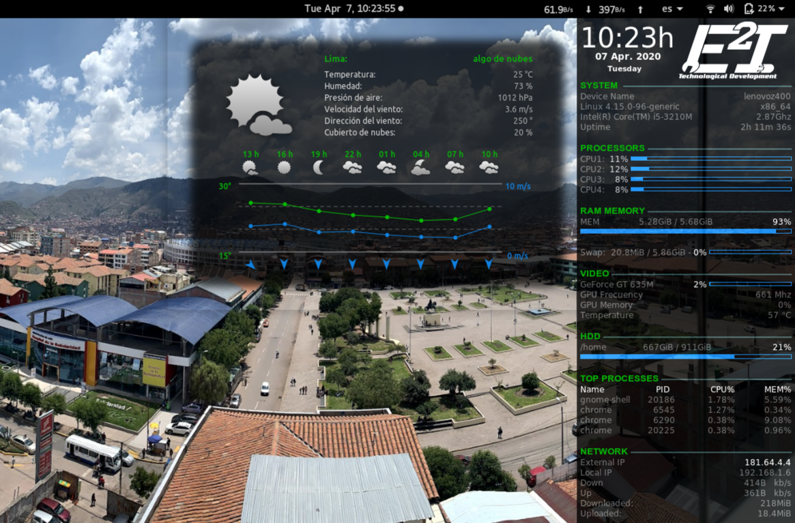

# Conky -Widgets

##### Widget for Linux/Ubuntu 18.04.

Add ``startConky.sh`` to "StartUp Application" in order to run at boot.

Copy all the files to ``~/.conky``:
1. Create folder ``~/.conky``.
2. Run ``copyTo.sh`` for copy all the files to ``~/.conky``.
3. Update new changes running ``update.sh``.

## Conkyrc + Conky ddweather

More information about *ddweather* [here](conky_ddweather/README.md).
<!--  -->

## Conky revolutionary Clocks

